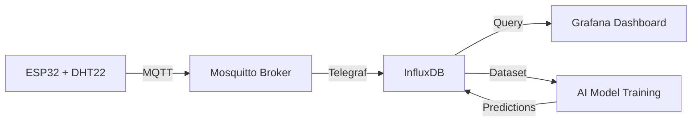

# ☁️ Solution Infrastructure (DigitalOcean Droplet)

Learning project to build an end-to-end AI solution integrating IoT, data storage, ETL, EDA, feature engineering, and MLOps practices.

This document explains how to **set up the infrastructure** to store and monitor IoT sensor data (temperature and humidity) from an **ESP32 + DHT22** system, hosted on a **DigitalOcean Droplet**.

---

## 🧩 1️⃣ General Infrastructure Overview



Data flow:

```
ESP32 → MQTT (Mosquitto) → Telegraf → InfluxDB → Grafana → (ML Models)
```

---

## ☁️ 2️⃣ Cloud Server Setup (DigitalOcean Droplet)

### 🔑 Generating an SSH Key

On your **local computer**, create a secure SSH key pair:

```bash
ssh-keygen -t ed25519 -C "device@name"
```

- The generated keys are stored locally:
  - **Windows:** `C:\Users\<username>\.ssh\`
  - **Linux/macOS:** `~/.ssh/`

You will see two files:
- `id_ed25519` → 🔒 private key (keep secure)
- `id_ed25519.pub` → 🔑 public key (add this one to DigitalOcean)

Copy the `.pub` file content and add it to your Droplet configuration.

---

### ☁️ Creating a DigitalOcean Droplet

| Parameter | Value |
|------------|--------|
| Plan | Basic (1 vCPU, 1 GB RAM, 25 GB SSD) |
| Cost | ~$5 USD/month |
| OS | Ubuntu 22.04 LTS |
| Authentication | SSH Key |

---

### 🔗 Connecting to the Droplet

```bash
ssh root@<your_droplet_public_IPv4>
```

Then update and install required packages:

```bash
apt update && apt upgrade -y
apt install git curl htop nano -y
```

#### 🐳 Install Docker + Compose

```bash
sudo apt install ca-certificates curl gnupg lsb-release -y
sudo mkdir -p /etc/apt/keyrings
curl -fsSL https://download.docker.com/linux/ubuntu/gpg | sudo gpg --dearmor -o /etc/apt/keyrings/docker.gpg

echo "deb [arch=$(dpkg --print-architecture) signed-by=/etc/apt/keyrings/docker.gpg] https://download.docker.com/linux/ubuntu $(lsb_release -cs) stable" | sudo tee /etc/apt/sources.list.d/docker.list > /dev/null

sudo apt update
sudo apt install docker-ce docker-ce-cli containerd.io docker-buildx-plugin docker-compose-plugin -y

docker --version
docker compose version
docker run hello-world
```

✅ **Tips**
- Always use your **public IPv4** (not private).
- Ensure **port 22/tcp** is open for SSH access:
  ```bash
  ufw allow 22/tcp
  ufw enable
  ```

---

## 🗄️ 3️⃣ Setting up InfluxDB (Time-Series Database)

```bash
mkdir -p /opt/iot-stack/influxdb
cd /opt/iot-stack
```

Create a `docker-compose.yml` file:

```bash
nano docker-compose.yml
```

Paste the following content:

```yaml
version: "3.9"

services:
  influxdb:
    image: influxdb:2.7
    container_name: influxdb
    ports:
      - "8086:8086"
    environment:
      DOCKER_INFLUXDB_INIT_MODE: setup
      DOCKER_INFLUXDB_INIT_USERNAME: admin
      DOCKER_INFLUXDB_INIT_PASSWORD: admin123
      DOCKER_INFLUXDB_INIT_ORG: Tecuhtli
      DOCKER_INFLUXDB_INIT_BUCKET: sensors
      DOCKER_INFLUXDB_INIT_RETENTION: 90d
      DOCKER_INFLUXDB_INIT_ADMIN_TOKEN: supersecrettoken
    volumes:
      - ./influxdb:/var/lib/influxdb2
    restart: unless-stopped

networks:
  default:
    driver: bridge
```

Then bring it up:

```bash
docker compose up -d
docker ps
curl -s http://localhost:8086/health
```

🌐 Access via browser:
```
http://<your_public_IPv4>:8086
```

| Credential | Value |
|-------------|--------|
| Organization | Tecuhtli |
| User | admin |
| Password | admin123 |
| Token | supersecrettoken |

---

## ⚙️ 4️⃣ IoT Stack (Mosquitto, Telegraf, InfluxDB, Grafana)

### 📂 Create folder structure
```bash
mkdir -p /opt/iot-stack/{mosquitto,telegraf,influxdb,grafana}
cd /opt/iot-stack
```

### 🐋 docker-compose.yml

```yaml
version: "3.9"

services:

  # 🛰️ Mosquitto (MQTT Broker)
  mosquitto:
    image: eclipse-mosquitto:2
    container_name: mosquitto
    ports:
      - "1883:1883"
      - "9001:9001"
    volumes:
      - ./mosquitto/mosquitto.conf:/mosquitto/config/mosquitto.conf:ro
      - ./mosquitto/data:/mosquitto/data
      - ./mosquitto/log:/mosquitto/log
    restart: unless-stopped

  # 🧠 InfluxDB
  influxdb:
    image: influxdb:2.7
    container_name: influxdb
    ports:
      - "8086:8086"
    environment:
      DOCKER_INFLUXDB_INIT_MODE: setup
      DOCKER_INFLUXDB_INIT_USERNAME: admin
      DOCKER_INFLUXDB_INIT_PASSWORD: admin123
      DOCKER_INFLUXDB_INIT_ORG: Tecuhtli
      DOCKER_INFLUXDB_INIT_BUCKET: sensors
      DOCKER_INFLUXDB_INIT_RETENTION: 90d
      DOCKER_INFLUXDB_INIT_ADMIN_TOKEN: supersecrettoken
    volumes:
      - ./influxdb:/var/lib/influxdb2
    restart: unless-stopped

  # ⚙️ Telegraf
  telegraf:
    image: telegraf:1.30
    container_name: telegraf
    depends_on:
      - mosquitto
      - influxdb
    volumes:
      - ./telegraf/telegraf.conf:/etc/telegraf/telegraf.conf:ro
    restart: unless-stopped

  # 📊 Grafana
  grafana:
    image: grafana/grafana:10.4.5
    container_name: grafana
    depends_on:
      - influxdb
    ports:
      - "3000:3000"
    volumes:
      - ./grafana:/var/lib/grafana
    environment:
      GF_SECURITY_ADMIN_USER: admin
      GF_SECURITY_ADMIN_PASSWORD: admin123
    restart: unless-stopped

networks:
  default:
    driver: bridge
```

---

### 🧾 Configuration Files

#### Mosquitto
```bash
nano mosquitto/mosquitto.conf
```

```bash
listener 1883
allow_anonymous true
persistence true
persistence_location /mosquitto/data/
log_timestamp_format %Y-%m-%dT%H:%M:%S
# listener 9001
# protocol websockets
```

#### Telegraf
```bash
nano telegraf/telegraf.conf
```

```toml
[agent]
interval = "10s"
flush_interval = "10s"
omit_hostname = true

[[inputs.mqtt_consumer]]
servers = ["tcp://mosquitto:1883"]
topics = ["home/lab/dht22"]
client_id = "telegraf-bridge"
qos = 0
connection_timeout = "30s"
persistent_session = false
data_format = "json"
json_string_fields = ["sensor_id", "location", "ts"]

[[processors.converter]]
[processors.converter.tags]
  string = ["sensor_id", "location"]
[processors.converter.fields]
  float = ["temp_c", "hum_pct"]

[[processors.override]]
namepass = ["mqtt_consumer"]
name_override = "dht22"

[[outputs.influxdb_v2]]
urls = ["http://influxdb:8086"]
token = "supersecrettoken"
organization = "Tecuhtli"
bucket = "sensors"
timeout = "10s"
```

---

### 🚀 Start the Stack

If you had previous containers, stop and remove them:

```bash
docker compose down
docker ps
```

Then bring everything up:

```bash
docker compose up -d
docker compose ps
curl -s http://localhost:8086/health
```

✅ If `"status": "pass"`, the system is running correctly.

---

## 🧩 5️⃣ Quick Validation Checklist

| Check | Command | Expected Result |
|--------|----------|----------------|
| Docker services running | `docker ps` | All 4 containers healthy |
| MQTT working | `mosquitto_sub -t home/lab/dht22 -v` | Incoming JSON messages |
| Data flowing | `docker logs telegraf` | “Successfully wrote batch” |
| Influx bucket active | `curl http://localhost:8086/api/v2/buckets` | “sensors” listed |
| Grafana accessible | `http://<IP>:3000` | Grafana login page |

---

## 🧾 Summary

This document explains how to build the infrastructure required to store and monitor IoT sensor data.  
It represents the **first stage** in implementing an **end-to-end AI solution** for forecasting environmental variables (temperature, humidity) using **AI and MLOps** practices.

Complementary stages can be found in this repository.
