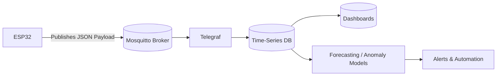

# 🌡️ IoT Data Acquisition (ESP32 + DHT22)

End-to-End IoT Data Pipeline + Forecasting System

This document explains how to **generate, sense, and transmit IoT data** from ESP32 boards equipped with DHT22 sensors.  
Each ESP32 device represents a **unique location**, collecting temperature and humidity readings and transmitting them via **MQTT** to the cloud infrastructure described in the previous document.

---

## 🎯 Project Goals

- Acquire environmental sensor data in real time  
- Stream telemetry over MQTT to the cloud  
- Store time-series data for analysis and forecasting  
- Monitor live sensor status via Grafana  
- Enable ML-based forecasting and anomaly detection  

---

## 🧰 1️⃣ Requirements

### 🔧 Hardware

| Qty | Device               | Purpose |
|----:|----------------------|----------|
| 4   | ESP32 WROOM      | Microcontroller for each location |
| 4   | DHT22 (encapsulated) | Temperature & humidity sensor |
| 4   | USB Cable            | Power + data |
| 4   | Breadboard/jumpers   | Clean assembly (optional) |

⚠️ **Important:**  
Each ESP32 reads only **one DHT22 sensor**, because each board represents a **different location** in the environment (e.g., living room, office, lab).

---

### 💾 Software

| Tool | Purpose | Notes |
|------|----------|-------|
| MicroPython / esptool | Flash firmware to ESP32 | `pip install esptool` |
| MQTT Broker (Mosquitto) | Lightweight IoT message broker | Runs on your Droplet |
| Telegraf | MQTT → InfluxDB ingestion | Subscribes to topics |
| InfluxDB | Time-series database | Stores telemetry |
| Grafana | Visualization | Monitors readings |

---

## 🏛️ 2️⃣ System Architecture



---

## 📡 3️⃣ MQTT Topic Convention

All devices publish under the same root topic, with their specific location appended:

```bash
home/<location>/dht22
```

### Examples
- `home/LivingRoom/dht22`
- `home/Office/dht22`
- `home/Kitchen/dht22`
- `home/Lab/dht22`

Each location corresponds to **one ESP32 + DHT22 pair**.

---

## 🔌 4️⃣ Wiring — Sensor to ESP32

Each DHT22 sensor uses 3 active pins:

| DHT22 Pin | ESP32 Pin | Notes |
|-----------|------------|--------|
| VCC | 3.3V | Power supply (do **not** use 5V) |
| DATA | GPIO 4 | Data signal (customizable if needed) |
| GND | GND | Shared ground |

⚠️ Use 3.3V — supplying 5V can cause unstable readings on the ESP32.

---

## 💻 5️⃣ Preparing the ESP32 Devices

### 🧹 Erase Existing Firmware
```bash
esptool erase_flash
```
> Ensure your ESP32 port appears in your system’s device list before running this command.

---

### ⚙️ Flash MicroPython Firmware
```bash
esptool --baud 460800 write_flash 0x1000 <ESP32_FIRMWARE.bin>
```

---

### 👀 Test Sensor Communication

```python
from machine import Pin
import dht, time

sensor = dht.DHT22(Pin(4))  # Change 4 if you used a different GPIO
while True:
    sensor.measure()
    print("🌡️ Temp:", sensor.temperature(), "°C   💧 Hum:", sensor.humidity(), "%")
    time.sleep(2)
```

---

## 📶 6️⃣ Program ESP32 to Publish Over MQTT

```python
import network, time, json
from umqtt.simple import MQTTClient
from machine import Pin
import dht

# --- WiFi Configuration ---
WIFI_SSID = "<YOUR_WIFI_SSID>"
WIFI_PASS = "<YOUR_WIFI_PASSWORD>"

print("Connecting to WiFi...")
sta = network.WLAN(network.STA_IF)
sta.active(True)
sta.connect(WIFI_SSID, WIFI_PASS)
while not sta.isconnected():
    time.sleep(0.5)
print("✅ Connected:", sta.ifconfig())

# --- MQTT Configuration ---
MQTT_BROKER = "<YOUR_DROPLET_IPv4>"  # Public IP of your DigitalOcean Droplet
MQTT_TOPIC = "home/<LOCATION>/dht22"
CLIENT_ID = "<SENSOR_ID>"  # Example: sensor-lab-01

# --- Sensor Setup ---
sensor = dht.DHT22(Pin(4))
client = MQTTClient(CLIENT_ID, MQTT_BROKER, port=1883)
client.connect()
print("✅ Connected to MQTT broker")

while True:
    try:
        sensor.measure()
        temp = sensor.temperature()
        hum = sensor.humidity()
        payload = {
            "sensor_id": CLIENT_ID,
            "location": "<LOCATION>",
            "temp_c": temp,
            "hum_pct": hum,
            "ts": time.time()
        }
        msg = json.dumps(payload)
        client.publish(MQTT_TOPIC, msg)
        print("📡 Published:", msg)
        time.sleep(60)  # send every 60 seconds
    except Exception as e:
        print("⚠️ Error:", e)
        time.sleep(5)
```

---

## 🔐 7️⃣ Security Notes

- Avoid hardcoding WiFi credentials in production.  
  Use a separate file such as `secrets.py`:
  ```python
  WIFI_SSID = "MySSID"
  WIFI_PASS = "MyPass"
  ```
- Handle network reconnection logic in production (retry with exponential backoff).
- Use QoS = 1 and authentication on Mosquitto in real deployments.

---

## ✅ 8️⃣ Quick Validation

| Check | Method | Expected Output |
|--------|---------|----------------|
| WiFi connection | ESP32 serial monitor | “✅ Connected” |
| MQTT connection | ESP32 serial monitor | “✅ Connected to MQTT broker” |
| Message publish | ESP32 serial monitor | “📡 Published: {...}” |
| Broker reception | `mosquitto_sub -t home/# -v` | JSON payload visible |
| Data storage | Grafana panel | Updates every 60 seconds |

---

## 🧾 Summary

Each ESP32 device collects environmental data from a single DHT22 sensor and publishes it to a centralized MQTT broker.  
The data flows through **Telegraf → InfluxDB → Grafana**, enabling monitoring and future forecasting with ML models.  

This document represents the **second stage** of the IoT Forecasting System — focusing on **data generation and transmission**.

Complementary stages (ETL, ML, MLOps) follow in subsequent documents.
