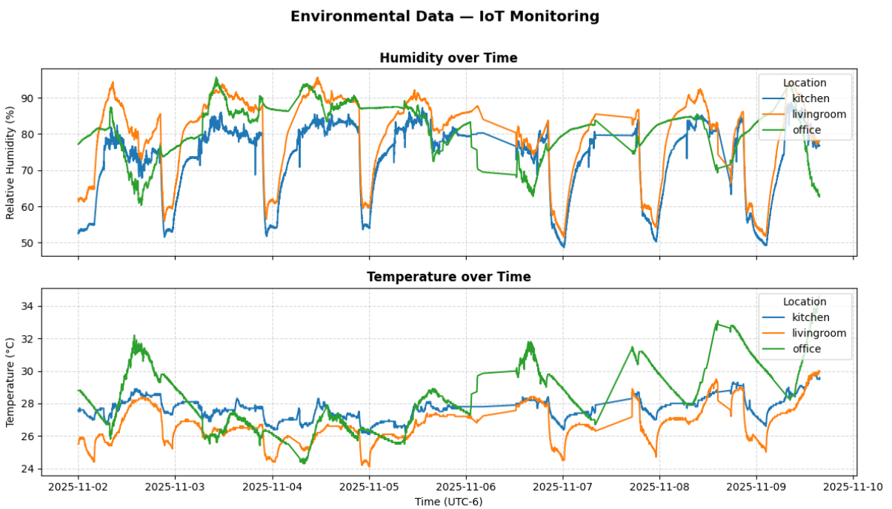
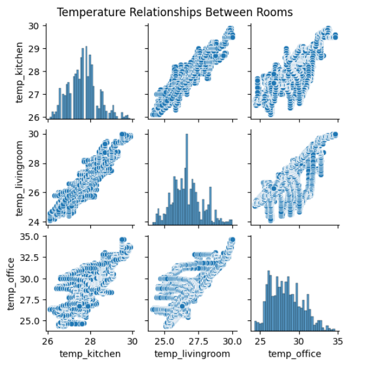
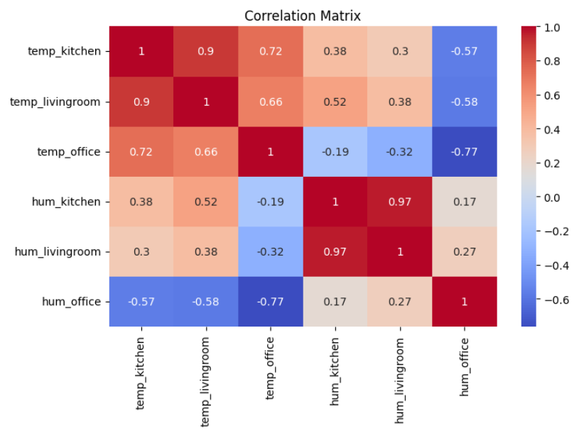
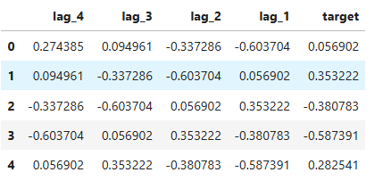
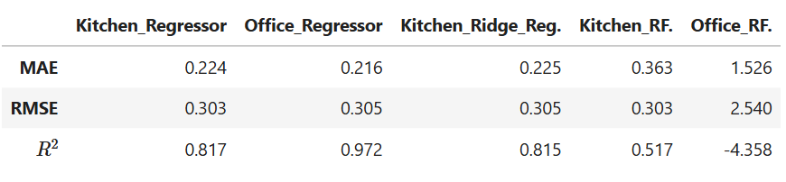
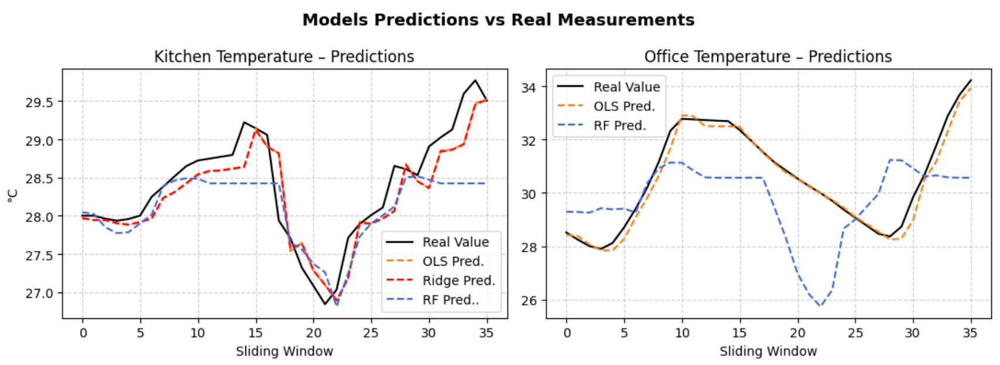
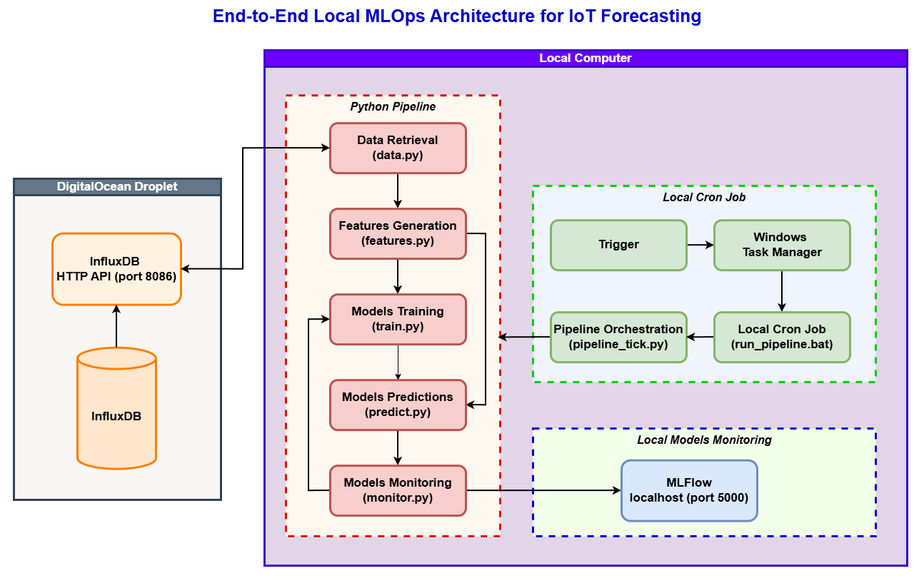
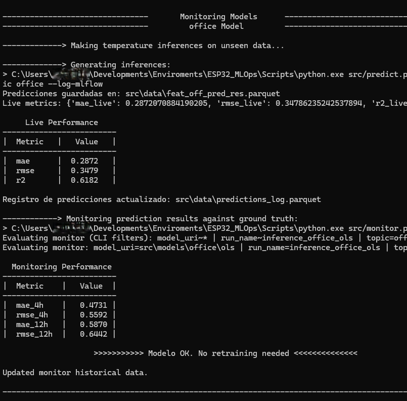
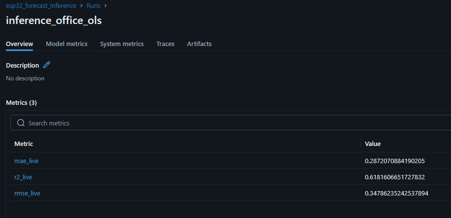
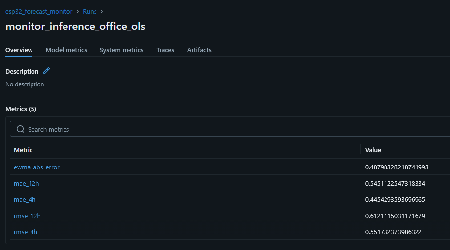

# 🎓 MLOps Project — Forecasting Environmental Factors

## Introduction

MLOps has become an **essential** component of modern data-driven solutions. It plays a critical role in enabling end-to-end systems to adapt when the original model was not designed to handle new scenarios.  

In this project, which focuses on predicting temperature and humidity at specific locations under current environmental conditions, the system is expected to behave correctly by forecasting values based on historical sensor measurements.

However, factors such as **climate change**, **changes in the operation of the acquisition system**, or even **the construction of new buildings** near the measurement points can affect the performance of the deployed model.  

This is why **MLOps practices are crucial**, they allow the solution to adapt to unpredictable yet expected situations.

Some examples that can affect the behavior of this solution are summarized below:

```markdown
| Scenario                           | Effect                                   | Type of Drift  |
|------------------------------------|------------------------------------------|----------------|
| Climate change                     | Change in data distribution              | Data drift     |
| New building nearby                | Change in environmental conditions       | Data drift     |
| DAQ voltage regulation changes     | Change in how data is sensed/acquired    | Concept drift  |
```

MLOps practices enable the solution to adapt to these unknown but probable circumstances by adjusting how data is acquired, normalizing or creating new features, and retraining the model to align with the new conditions.

Examples of how these situations can be addressed are presented below:

```markdown
| Scenario                      | MLOps Action           | Effect                                   |
|-------------------------------|------------------------|------------------------------------------|
| Climate change                |Retraining pipeline     |Adjusts model to the new data distribution|
| New building nearby           |Input feature adjustment|Normalizes or introduces new inputs       |
| DAQ voltage regulation changes|Root cause analysis     |Calibration or replacement of the DAQ sys.|
```

## Solution Architecture for Data Storage

Data is acquired using the **ESP32 board**, a microcontroller-based device with integrated voltage regulators, wireless connectivity, and general-purpose input systems —specifically the **ESP32-WROOM** version ([ESP32 official documentation](https://www.espressif.com/en/products/socs/esp32)).  
This device is widely used, along with similar technologies such as Arduino and Raspberry Pi, for IoT applications.

In this project, the **ESP32 board** is used to acquire data from [DHT22](https://cdn.sparkfun.com/assets/f/7/d/9/c/DHT22.pdf) sensors (3-pin encapsulated configuration), which include a **capacitive humidity sensor** and a **thermistor** to measure environmental humidity and temperature, respectively.

Once acquired, the data is stored in a **time-series database**, [InfluxDB](https://www.influxdata.com/), which serves as the foundation for forecasting future behaviors of the measured environmental variables.  
The storage infrastructure runs on an **Infrastructure as a Service (IaaS)** provider — [DigitalOcean](https://www.digitalocean.com/), where a Droplet hosts the complete data ingestion and visualization stack.

More information about data acquisition and storage can be found in the following documents:  
- [Infrastructure Setup](Documents/01_infrastructure.md)  
- [IoT Data Acquisition](Documents/02_data_acquisition.md)

The figure below shows the architecture used for the acquisition and storage of data:

<p align="center">
  
</p>
<p align="center"><em>Figure 1.- IoT-to-cloud architecture used to collect environmental data from ESP32+DHT22 sensors, transmit it via MQTT, and store and visualize it using Telegraf, InfluxDB, and Grafana.</em></p>

## Technology Stack

The following technologies and tools were used to build the end-to-end IoT + MLOps solution:

| Layer | Technologies | Purpose |
|:------|:--------------|:---------|
| **IoT Acquisition** | [ESP32-WROOM](https://www.espressif.com/en/products/socs/esp32), [DHT22](https://cdn.sparkfun.com/assets/f/7/d/9/c/DHT22.pdf) | Sensor nodes for temperature and humidity data collection |
| **Data Ingestion** | [Mosquitto MQTT Broker](https://mosquitto.org/), [Telegraf](https://www.influxdata.com/time-series-platform/telegraf/) | Receives, subscribes, and transforms MQTT messages from ESP32 devices |
| **Storage** | [InfluxDB](https://www.influxdata.com/) | Time-series database for structured sensor data storage |
| **Visualization** | [Grafana](https://grafana.com/) | Real-time dashboards for monitoring environmental metrics and model performance |
| **Machine Learning** | [statsmodels](https://www.statsmodels.org/stable/index.html), [scikit-learn](https://scikit-learn.org/) | Forecasting models (Linear Regression, Ridge, Random Forest) |
| **MLOps & Infrastructure** | [Git](https://git-scm.com/), [DVC](https://dvc.org/), [MLflow](https://mlflow.org/), [Docker](https://www.docker.com/), [DigitalOcean Droplet](https://www.digitalocean.com/) | Version control, experiment tracking, containerization, and cloud deployment |

---

<p align="center">
  <em>Table 1. Summary of the technology stack used in the IoT-to-Cloud MLOps architecture.</em>
</p>

## Forecasting Temperatures

The goal of this project is to demonstrate the implementation of MLOps workflows for building and deploying predictive solutions. Here, the focus is on temperature forecasting, using both statistical and machine learning models to anticipate environmental behavior and support data-driven decision-making.

The complete Jupyter notebook containing the data processing and modeling workflow can be found at:

- 📓 [**Data Processing and Temperature Forecasting Model**](DataProcessing/TemperatureForecastingModel.ipynb)  

### Data Extraction and Cleaning

The dataset was retrieved from InfluxDB and converted into a Pandas DataFrame for preprocessing.
Records corresponding to the Room location were excluded due to an excessive number of null values. The remaining missing data were imputed by calculating the mean of the temporally adjacent valid observations, obtaining the following result:

<p align="center">
  
</p>
<p align="center"><em>Figure 2.- Time series of humidity and temperature measurements recorded in the kitchen, living room, and office.</em></p>

### Exploratory Data Analysis

The exploratory analysis revealed a strong positive correlation between the temperature measurements in the living room and the kitchen, indicating that a single predictive variable could sufficiently represent both locations.

However, the office exhibited weaker and less consistent correlations with the other areas. The distribution analysis further confirmed that its temperature behavior does not follow a strictly linear relationship, suggesting that additional features or non-linear modeling may be required to represent it accurately.

<p align="center">
  
  
</p>
<p align="center"><em>Figure 3.- The left panel displays the temperature distributions for the three monitored areas, along with their pairwise relationships. The right panel shows the corresponding Pearson correlation coefficients between the measurements in each location.</em></p>

### Feature Engineering

Since the main objective of this project is to demonstrate MLOps practices, the predictive models used for temperature forecasting will follow a simple modeling approach. Therefore, the previous four temperature measurements will be used as features to predict the temperature one hour ahead.

Additionally, the temperature values are rescaled to a normalized range to avoid bias toward higher or lower amplitude readings. This is particularly important because linear regression will be one of the models implemented, and scaling helps improve model stability and interpretability.

<p align="center"><em>Table 1. Feature set and target variable used for the forecasting model.</em></p>
<p align="center">
  
</p>

### Model Training and Evaluation

Linear Regression and Random Forest are used as baseline regressors to predict the next-hour temperature. Before training, several data properties were examined, including normality, error homoscedasticity, and multicollinearity. However, due to the nature of temperature dynamics and the continuity of measurements over time, correlation between consecutive temperature values is expected. This temporal dependence is considered when selecting and evaluating the predictive models.

As a complement, Ridge regularization was applied to the model trained on the kitchen data to improve performance, particularly in comparison with the regression model for the office. Additionally, two Random Forest regressors were trained to evaluate a non-linear modeling approach and compare it against the linear alternatives.

The following table shows the performance of the trained models when predicting unseen temperature data. Results indicate that the Linear Regression models achieved higher accuracy compared to the Random Forest regressors under the evaluated conditions.


<p align="center"><em>Table 2. Performance metrics for the trained regressors.</em></p>
<p align="center">
  
</p>

Furthermore, the next figure compares the predictions generated by each trained model with the ground truth temperature values, allowing us to evaluate how closely each model reproduces the actual behavior.

<p align="center">
  
</p>
<p align="center"><em>Figure 4. Predicted temperature values from each model plotted alongside the ground truth on unseen test data.</em></p>

### Conclusions

The summarized results confirm that **linear models (OLS and Ridge)** outperform the Random Forest regressors in both environments. The Ridge model achieves similar accuracy to OLS while improving stability, whereas the Random Forest introduces unnecessary complexity, leading to reduced performance, particularly in the Kitchen dataset.

These baseline models establish a reliable foundation for implementing monitoring, drift detection, and automated retraining within an MLOps pipeline, which will be developed in the next stage of this project.


## MLOps Pipeline

The forecasting models developed above represent the first stage of the solution — establishing a reliable baseline that can be continuously monitored and improved over time.
This project focuses on the foundations of an MLOps workflow, implementing the essential components required for future monitoring and automation of improvements.
Deployment and full pipeline integration will be developed in separate projects.

### Objectives of the MLOps Pipeline

- Develop a Python script for [***data retrieval and cleaning***](src/data.py)
- Develop Python scripts for [***feature generation***](src/features.py) and [***model training***](src/train.py)
- Develop Python scripts for [***temperature prediction***](src/predict.py) and [***model monitoring***](src/monitor.py)
- Use MLflow to log and monitor key parameters of trained models
- Develop a Python script for [***pipeline orchestration***](src/pipeline_tick.py)
- Create a [***local cron job***](run_pipeline.bat) triggered by monitoring results for automated retraining


### Architecture Overview (MLOps Layer)

The architecture diagram below illustrates the MLOps pipeline implemented for continuous model training, evaluation, and retraining. In this setup, Ordinary Least Squares (OLS) models are trained using the previous 168 hours (one week) of historical temperature data, excluding the most recent 12 hours. Temperature measurements collected every minute are aggregated into hourly averages, although this windowing strategy can be adjusted depending on system requirements.

The MLOps layer evaluates the model every 10 minutes using the most recent 12 hours of data, data that was not included during training. The model’s predictions over this window are compared against the actual observed temperatures, and performance metrics are computed. If these metrics fall below predefined threshold values, the pipeline automatically triggers a retraining process to restore the expected performance level.

It is important to highlight that the objective at this stage is not to forecast future temperature values. Instead, the model is used to infer temperature values within the latest 12-hour window, strictly for performance monitoring and reliability assessment. By continuously comparing predictions against known ground truth, the system ensures model stability and enables autonomous detection and correction of performance degradation.


<p align="center">
  
</p>
<p align="center"><em>Figure 5. End-to-end local MLOps architecture integrating IoT data ingestion (InfluxDB), automated training and monitoring pipelines, and MLflow-based model tracking.</em></p>

The architecture enables continuous model improvement by constantly performing inferences and evaluating performance against predefined metrics. If the model’s performance degrades or falls below the expected threshold, it is automatically retrained until it reaches the desired accuracy level.

<p align="center">
  
</p>
<p align="center"><em>Figure 6. The screenshot above was captured during the execution of the Python-based pipeline orchestration.</em></p>

### MLflow Tracking and Monitoring

MLflow is used to track each experiment by storing model parameters, metrics, and artifacts generated during the training, inference, and monitoring stages. This enables version comparison, performance degradation detection, and visualization of results through the local MLflow UI (http://localhost:5000). By integrating MLflow into the pipeline, every training or retraining step is automatically logged, ensuring full traceability and reproducibility.

Local monitoring was implemented due to limitations in the Droplet specifications, particularly the use of a shared CPU and limited memory. These hardware constraints made it difficult to correctly deploy remote services, as the available resources were insufficient for running concurrent tracking and inference processes.

It is importanty to remank, to use mlflow locally it is neceesary to start the service locally, defining the location of the saved model runs, such as:

```bash
mlflow ui --backend-store-uri <path_to_your_mlruns_folder>
```

In this project, the model’s live performance is monitored through three fundamental metrics: Mean Absolute Error (MAE), Root Mean Squared Error (RMSE), and the Coefficient of Determination ($R^2$), which together offer a comprehensive view of prediction quality on unseen data.

<p align="center">
  
</p>
<p align="center"><em>Figure 7. MLflow dashboard showing live performance monitoring metrics for the Office model.</em></p>

Additionally, MLflow supports drift detection by tracking the Exponentially Weighted Moving Average (EWMA) of the prediction error, along with rolling MAE and RMSE computed over 4-hour and 12-hour rolling windows. These metrics enable early identification of performance degradation and facilitate timely retraining of the model.

<p align="center">
  
</p>
<p align="center"><em>Figure 8. MLflow dashboard illustrating continuous model monitoring using performance metrics computed over the last 12 hours.</em></p>


### Manual Use of Scripts

The following commands can be used to run the Python pipeline scripts manually. 
Keep script file locations unchanged, as some paths are hard-coded.

- **data.py** – Retrieve data from InfluxDB

```bash
# --hours_start  defines the starting point (in hours) for data retrieval
# --hours_stop   defines the ending point (in hours) for data retrieval
python <path_to_data.py> --hours_start <t1> --hours_stop <t2>
```

- ***features.py*** - Generating model inputs based on retrieved data

```bash
# --name  argument used to label whether features are related to training or inference scenarios
# Files saved with this suffix will be used for generating the corresponding feature sets
python <path_to_features.py> --name <tag>
```

- ***train.py*** - Training forecasting temperature models

```bash
# Trains OLS models used within the MLOps monitoring pipeline
# Outputs:
#   - Model artifacts saved under src/models/<topic>/ols/
#   - Performance metrics logged to MLflow
python <path_to_train.py>
```

- ***predict.py*** - ***predict.py*** - Generates temperature estimates on unseen data (for monitoring)

```bash
# Runs inference on new hourly feature data that was not used during training.
# The predictions are appended to `src/data/predictions_log.parquet`,
# which is later used by monitor.py to evaluate model performance.
#  --local-dir <path_to_model_folder> \
#  --input-parquet <path_to_feature_file> \
#  --run-name <tag_for_logging> \
#  --topic <kitchen|office>
python <path_to_predict.py>
```

- ***monitor.py*** - Evaluates model performance for MLOps monitoring

```bash
# Evaluates the most recent model predictions against ground-truth temperature values.
# If performance degrades beyond predefined thresholds, a retraining flag is created:
# -    data/RETRAIN_NEEDED.flag
# The monitor reads:
#   - src/data/predictions_log.parquet   (generated by predict.py)
#   - src/data/truth_log.parquet         (ground-truth temperature values)
python <path_to_monitor.py>
```

- ***pipeline_tick.py*** - Orchestrates the full monitoring pipeline

```bash
# Executes one full monitoring cycle:
# - Retrieve last 12h of new data (not used during training)
# - Generate feature set for monitoring
# - Run inference for each topic (e.g., kitchen / office)
# - Evaluate performance via monitor.py
# - If performance is below thresholds, then automatically retrains the model

python <path_to_pipeline_tick.py> --name <tag>
```

### Additional Files

- ***run_pipeline.bat*** -  (Local Scheduler Script)
  
  This batch script triggers the full MLOps orchestration pipeline. It is intended to be executed periodically (e.g., every 10 minutes) using Windows Task Scheduler. If the project is moved to a different folder, update the paths inside the file accordingly.

- ***.env*** - Environment Configuration File
  
  The .env file contains the connection and configuration variables required by the pipeline
(e.g., MLFLOW_TRACKING_URI, database credentials, paths, etc.).
Update this file with values corresponding to your local or server environment before running the system.


### Securyty 

## Conclusion

MLOps practices enable the correction and continuous improvement of models when their performance degrades over time.
In this project, the workflow was implemented using a seven-day time window. However, for longer time intervals, or for more dynamic processes, MLOps can provide significant benefits by mitigating drift effects, as discussed in the introduction.

For the presented scenario, MLOps is expected to enhance the solution’s adaptability under varying climate conditions. Training the model on the most recent seven days of data allows it to remain accurate and responsive, while still retaining enough historical information to adapt to changes in the environment.

This implementation demonstrates how MLOps can ensure model reliability in real-world IoT environments, even under limited computational resources.

# FIN